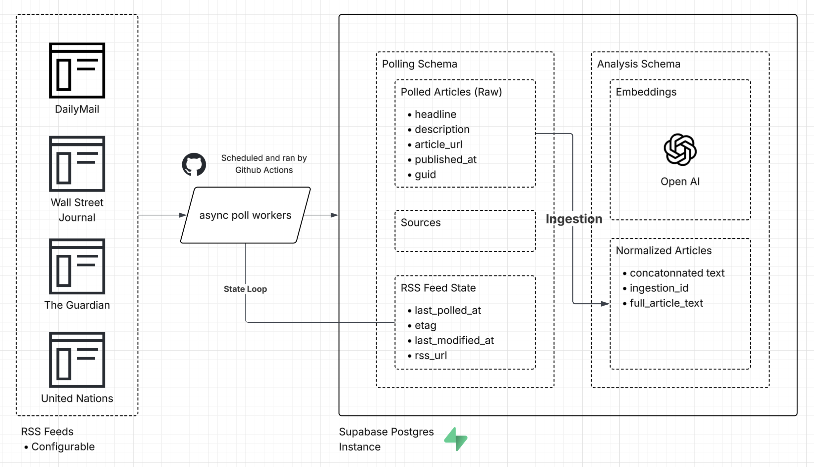

[//]: # (Project README for SR data analysis)
# Trend Analysis of News Stories for SightRead

<p align="center">
  
  
</p>

*Figure: Clusters based on news reporting during January 5th - January 12th* 

## Project Goals & Research Questions

This repository explores the viability of unsupervised learning techniques for **trend detection in large-scale news corpora**, with direct application to the SightRead reading platform.

The workflows here are designed to answer the following questions:

- **Clustering algorithm viability**  
  How effectively do different clustering approaches surface coherent, recurring news themes over short and rolling time windows?

- **Dimensionality reduction trade-offs**  
  How do techniques such as PCA or UMAP impact semantic separation, cluster stability, and interpretability compared to clustering directly in embedding space?

- **Cluster quality and stability**  
  Are detected clusters robust under resampling, parameter changes, and alternative embeddings, or are they artifacts of individual runs?

- **Trend detection feasibility**  
  Given real-world news noise, topic overlap, and high churn, can unsupervised methods reliably identify trends meaningful enough for downstream summarization and streaming?

Rather than optimizing for a single “best” model, this repository focuses on **empirical comparison of pipelines**, documenting strengths, limitations, and failure modes.


## Open Datasets

To support reproducibility and independent analysis, please access the three datasets i've collected [here](https://www.kaggle.com/datasets/esvansun06/sr-trend-analysis/data/settings/settings/settings), released freely for public use.

Each dataset includes:
- RSS article metadata and timestamps
- Normalized and cleaned article text (where available)
- Precomputed embeddings for selected experimental runs

These datasets are intended for:
- Benchmarking clustering and dimensionality-reduction techniques
- Exploring alternative models, parameters, or evaluation metrics
- Independent validation or extension of the analyses presented here

No authentication, API keys, or external services are required to access the datasets included in this repository.


## Data Aggregation Diagram

<p align="center">
	
</p>

*Figure: Data aggregation flow (see full-size image by clicking the diagram).* 

## Data Collection & Aggregation

The dataset is constructed using an automated RSS aggregation pipeline designed to reflect real-world ingestion constraints.

**Collection process**
- RSS feeds are polled on a fixed schedule using cron-driven jobs
- Each feed is fetched at a configurable interval to avoid over-polling
- Articles are deduplicated and timestamped at ingestion time
- Full-text extraction is performed when content is available

**Ingestion characteristics**
- Polling is asynchronous and resilient to partial feed failures
- Feeds returning malformed responses or no updates are skipped safely
- Articles are stored with source, feed category, and retrieval metadata to support downstream analysis

**Sources**
The dataset aggregates stories from a diverse set of international and regional outlets, including:
- United Nations News
- Fox News
- Daily Mail
- Wall Street Journal (metadata-only where full text is unavailable)
- The Guardian

This source diversity is intentional, introducing stylistic variance, topical overlap, and editorial bias to stress-test clustering and trend-detection methods under realistic conditions.


### RSS Feed Curation for the Dataset
_See below for the exact RSS feeds used for each news outlet_

``` yml
# Sources for SightRead aggregator
# This list is commonly subject to change

sources:
  - name: United Nations
    homepage_url: https://news.un.org/en/
    rss:
      #works
      - category: global
        feed_url: https://news.un.org/feed/subscribe/en/news/region/global/feed/rss.xml
      - category: middle east
        feed_url: https://news.un.org/feed/subscribe/en/news/region/middle-east/feed/rss.xml

  - name: Fox News
    homepage_url: https://www.foxnews.com/
    rss:
      # works
      - category: world
        feed_url: https://moxie.foxnews.com/google-publisher/world.xml

  - name: Daily Mail
    homepage_url: https://www.dailymail.co.uk/home/index.html
    rss:
      # works
      - category: news
        feed_url: https://www.dailymail.co.uk/news/index.rss

  - name: Wall Street Journal
    homepage_url: https://www.wsj.com/
    rss:
      # works but can't ingest text
      - category: world
        feed_url: https://feeds.content.dowjones.io/public/rss/RSSWorldNews

  - name: The Guardian
    homepage_url: https://www.theguardian.com/international
    rss:
      # works
      - category: world
        feed_url: https://www.theguardian.com/world/rss
      - category: international
        feed_url: https://www.theguardian.com/international/rss
```